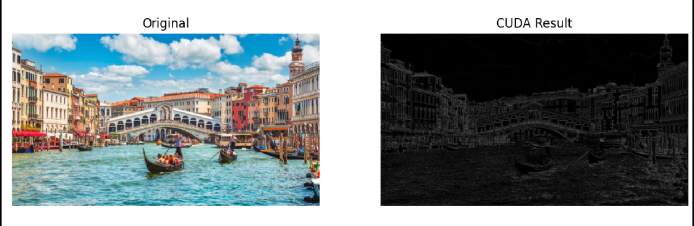

<div align="center">

# 🖼️ Image Convolution with CUDA


**GPU-accelerated 2D image convolution using NVIDIA CUDA**  
*A practical, educational project demonstrating classic image filters with shared-memory optimization.*

</div>

---

## 📑 Table of Contents
- [About](#about)
- [Filters Implemented](#filters-implemented)
- [Demo](#demo)
- [Project Structure](#project-structure)
- [Getting Started](#getting-started)
  - [Prerequisites](#prerequisites)
  - [Build](#build)
  - [Run](#run)
- [Usage](#usage)
- [Contributing](#contributing)
- [License](#license)

---

## 🧠 About

This project implements **2D image convolution on the GPU using CUDA**, focusing on clarity, correctness, and performance.  
It applies common **3×3 convolution filters** to images and compares results with a CPU-style pipeline.

To achieve efficient execution, the CUDA kernel uses:
- **Thread tiling**
- **Shared memory**
- **Halo (boundary) exchange**

A **Python CLI** is provided to simplify building, running, and visualizing results.

---

## ✨ Filters Implemented

The following convolution filters are available:

- `identity`
- `gaussian`
- `edge`
- `sharpen`

### Edge Detection Kernel

The **edge filter** highlights intensity discontinuities by subtracting surrounding pixels from the center pixel:

\[
\begin{bmatrix}
-1 & -1 & -1 \\
-1 & \;\;8 & -1 \\
-1 & -1 & -1
\end{bmatrix}
\]

This kernel suppresses flat regions while preserving sharp transitions such as object boundaries.

---

## 🖼️ Demo

### Edge Detection — CUDA Output



**Left:** Original image  
**Right:** Output after CUDA convolution using the edge detection kernel

---

## 📁 Project Structure

```

Image_Convolution_with_CUDA/
├── Makefile
├── README.md
├── .gitignore
├── include/            # External headers (e.g. stb_image)
├── assets/
├── src/
│   ├── main.cpp        # Host-side logic
│   └── kernels.cu     # CUDA convolution kernels
├── scripts/
│   └── cli.py         # Python CLI (build, run, visualize)
└── data/
└── input images

````

---

## 🚀 Getting Started

### Prerequisites

- NVIDIA GPU with CUDA support
- CUDA Toolkit (tested with modern 11+ versions)
- `make`
- Python 3 (for CLI)

---

### Build

```bash
make ARCH=sm_75
````

Adjust `ARCH` to match your GPU compute capability.

---

### Run

Using the Python CLI:

```bash
python scripts/cli.py --build --image data/input.png --filter edge --show
```

---

## 🧪 Usage

CLI options include:

* `--build` : compile the project
* `--image` : input image path
* `--filter` : one of `identity | gaussian | edge | sharpen`
* `--show` : display the output image

This setup allows quick experimentation with different filters and images.

---

## 🤝 Contributing

Contributions are welcome.

Possible improvements:

* Additional convolution kernels
* Performance benchmarks (CPU vs GPU)
* Support for larger kernels
* RGB channel optimization
* Further shared-memory tuning

Fork the repository and submit a pull request.

---

## 📄 License

This project is licensed under the **MIT License**.

---

⭐ If you find this project useful, consider starring the repository.
